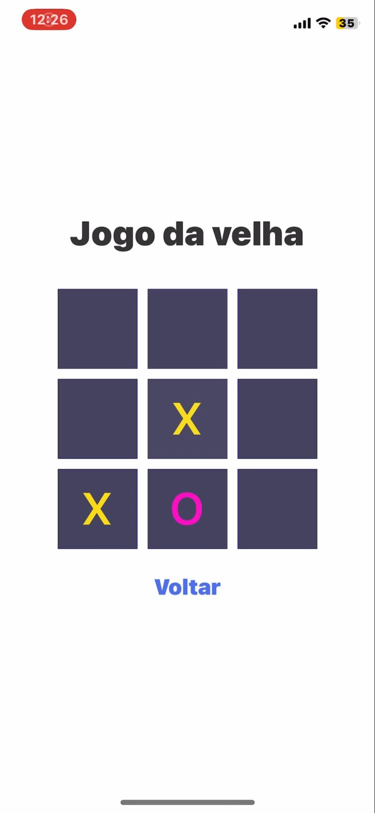

# Jogo da Velha em React Native

Este é um projeto simples do jogo da velha desenvolvido em React Native.

## Funcionalidades

- Permite que dois jogadores joguem o jogo da velha em um dispositivo móvel.
- Mostra o vencedor ou se houve empate ao final do jogo.
- Permite reiniciar o jogo para jogar novamente.

## Tecnologias utilizadas

- React Native
- JavaScript

## Como usar

1. Clone este repositório para o seu computador:

2. Acesse o diretório do projeto:

3. Instale as dependências do projeto:

4. Inicie o aplicativo em um emulador ou dispositivo físico:

## Contribuição

Contribuições são bem-vindas! Se você encontrar algum problema ou tiver melhorias a serem feitas, sinta-se à vontade para abrir uma issue ou enviar um pull request.

## Imagens do projeto

  
  
  
  
  

